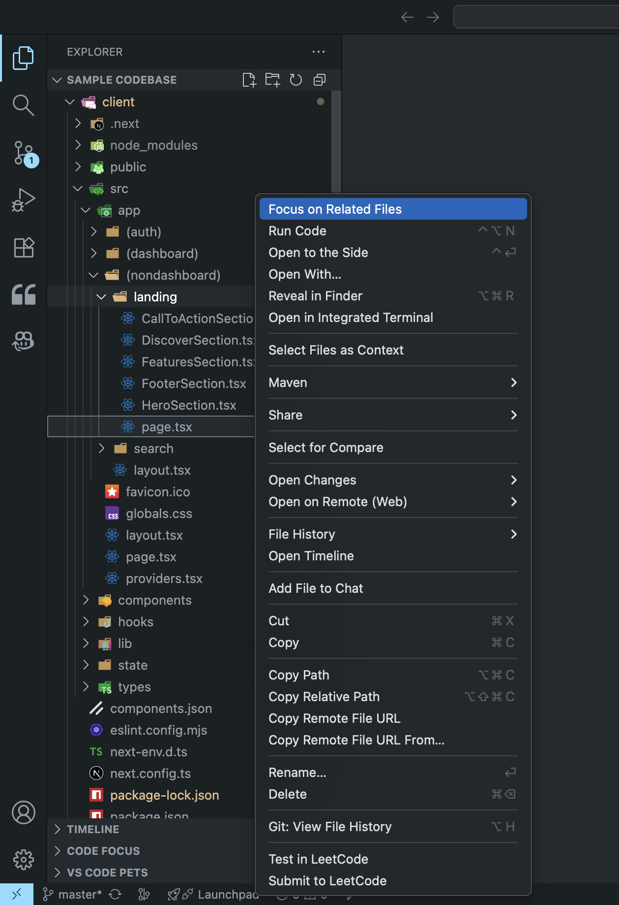
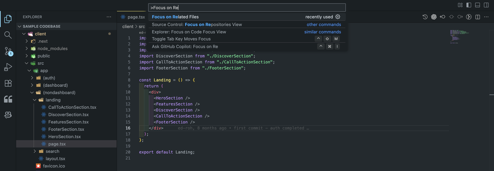
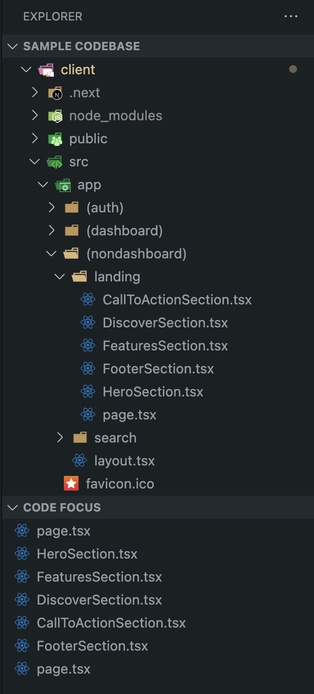

# Code Focus

[](https://marketplace.visualstudio.com/items?itemName=prateekbisht.code-focus)
[](https://marketplace.visualstudio.com/items?itemName=prateekbisht.code-focus)
[](LICENSE)

**Analyze and group related files to reduce navigation overhead when understanding code relationships in TypeScript and JavaScript projects.**

## What It Does

Code Focus helps developers understand code relationships by automatically grouping related files together. When working on a specific component or feature, you can instantly see all dependencies (files it imports) and dependents (files that import it) in one organized view.

This eliminates the need to manually search through the project structure or use "Go to Definition" repeatedly to understand how files are connected.

## How It Works

### Method 1: Right-click Context Menu

Right-click any `.ts`, `.tsx`, `.js`, or `.jsx` file in VS Code Explorer and select **"Focus on Related Files"**.



### Method 2: Command Palette

Use `Cmd+Shift+P` (macOS) or `Ctrl+Shift+P` (Windows/Linux), then type "Focus on Related Files".



## What You'll See

After running the command, a **Code Focus** panel will appear in the Explorer showing all related files organized by their relationship to your selected file.



The panel displays:

- **Dependencies**: Files imported by your selected file
- **Dependents**: Files that import your selected file
- **Focal File**: The file you're analyzing

Click any file in the focus view to open it instantly.

## Key Benefits

- **Reduce Context Switching**: See all related files at once instead of navigating back and forth
- **Understand Impact**: Know which files will be affected before making changes
- **Code Review**: Quickly assess the scope of changes across related components
- **Learning**: Map out file relationships in unfamiliar codebases
- **Refactoring**: Identify all files that need updates when modifying interfaces or exports

## Supported Files

- TypeScript: `.ts`, `.tsx`
- JavaScript: `.js`, `.jsx`

## Settings

| Setting          | Description                       | Default |
| ---------------- | --------------------------------- | ------- |
| `focus.showView` | Show Code Focus panel in Explorer | `true`  |

## Requirements

- VS Code 1.105.0 or higher
- TypeScript/JavaScript project with standard import/export syntax

## Limitations

- Dynamic imports (e.g., `import()`) are not analyzed
- Barrel exports may not be fully resolved in complex scenarios
- Performance may be slower in very large workspaces (>1000 files)

---

**Created by [Prateek Bisht](https://github.com/prateekbisht23)** | [Report Issues](https://github.com/prateekbisht23/code-focus/issues)

```

```
